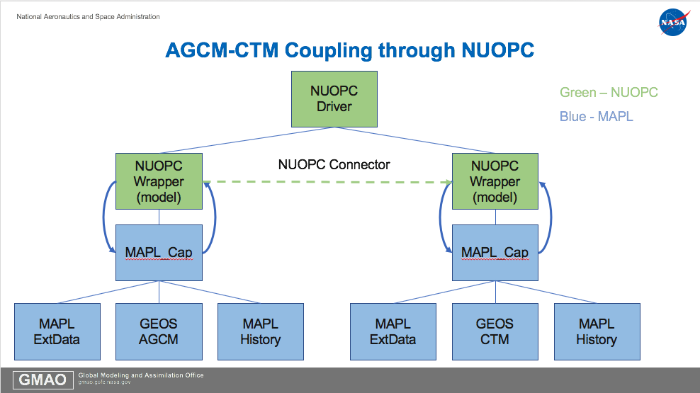

# MAPLWrapper

A wrapper to make MAPL components NUOPC-compliant. This wrapper offers
several unique features that unavailable through MAPL. It can run multiple MAPL components
concurrently on separate sets of processors, it can run MAPL
components on different grids and use ESMF re-gridding, and it gives
the ability to take an existing MAPL component or subtree and run it in a NUOPC
system. 

# Motivation

The motivation behind this wrapper is to make MAPL and NUOPC more
interopable. Despite both being based on ESMF there was no way for a
MAPL component to be run within NUOPC or vice-versa. A previous approach attempted
to manually convert the MAPL ExtData component into a NUOPC component
by replacing the MAPL code with NUOPC code,
but this approach was time-consuming and difficult due to the many
implicit assumptions that MAPL makes.

The approach taken in this wrapper is different: it wraps an entire
MAPL application or subtree at the Cap level with NUOPC. Through this
approach MAPL components can run as they are with no changes to
existing code. The NUOPC wrapper simply drives MAPL through a MAPL\_Cap object.

# Implementation

The wrapper is a NUOPC Model component that encapsulates a MAPL\_Cap
object which contains the entire MAPL hierarchy with three children:
History, ExtData, and a root component provided by the user, which may
have its own children. By wrapping at the
cap level MAPL retains all of its functionality and has no knowledge
of the NUOPC environment in which it is run.

The NUOPC wrapper merely acts as a container for the MAPL\_CAP and
maps its initilization and run routines onto the cap by querying it
for necessary information such as fields, grids, states, imports,
exports, etc, or by performing actions on it such as stepping the model.

The  advantage to this approach is its simplicity and that no changes are
needed at the MAPL level. The downside is that the wrapper is fairly
heavy and that it is not suitable for wrapping many individual
components since each instance of the wraper contains an entire MAPL
hierarchy with History and ExtData.

Therefore, this wrapper is best suited for wrapping entire MAPL
models or large pieces of it.



# Obtaining and Building

The wrapper requires MAPL and NUOPC to build and is included within
the latest version of MAPL included in the GEOS develop branch.

MAPL is currently only distributed with GEOS and is not
publicly available at this time.

Contact kyle.gerheiser@nasa.gov if
you would like to obtain a copy.

# Usage

To use the wrapper add a component to a NUOPC driver by calling
NUOPC\_DriverAddComp using the wrapper SetServices and then call
init\_wrapper on the returned ESMF\_GridComp with a name, the root
MAPL SetServices, and the CAP.rc for the MAPL instance.

```
call NUOPC_DriverAddComp(driver, "agcm", wrapper_ss, comp = agcm,
petlist = agcm_petlist, rc = rc)

call init_wrapper(wrapper_gc = agcm, name = "agcm", cap_rc_file =
"AGCM_CAP.rc", root_set_services = gcs_set_services, rc = rc)
```

Then, in the CAP.rc file you can add imports or exports to NUOPC from
MAPL.

For imports add a line called "CAP\_IMPORTS:" followed by a list of
MAPL import names. For exports it is "CAP\_EXPORTS:"you must also add a comma followed by
the component name.

For example,

```
CAP_IMPORTS:
	U
	V
	T
	Q
::

CAP_EXPORTS:
	U,DYN
	V,DYN
	Q,MOIST
::
```

This will automatically advertise and realize the imports and exports
for the NUOPC component, and can be connected with other components.

# Limitations and Future Work

The wrapper currently only supports a fairly limited number of NUOPC
features and some options are hardcoded. For example, there is no
option to enable field mirroring within the wrapper, and
TransferActionGeomObject is always on.
However, it is well suited for simply running a
component and connecting fields.

In the future the wrapper could be made more generic and support for more NUOPC options could be toggled.


